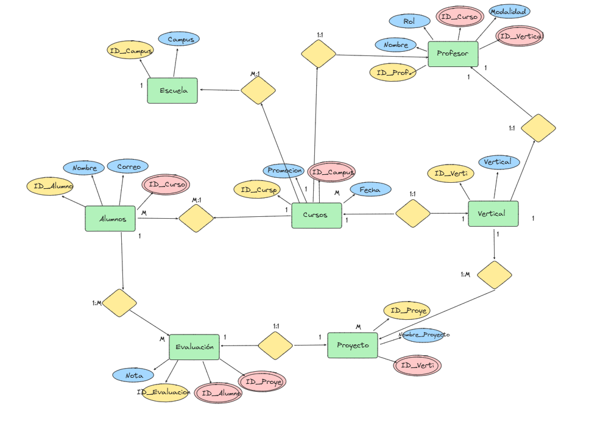
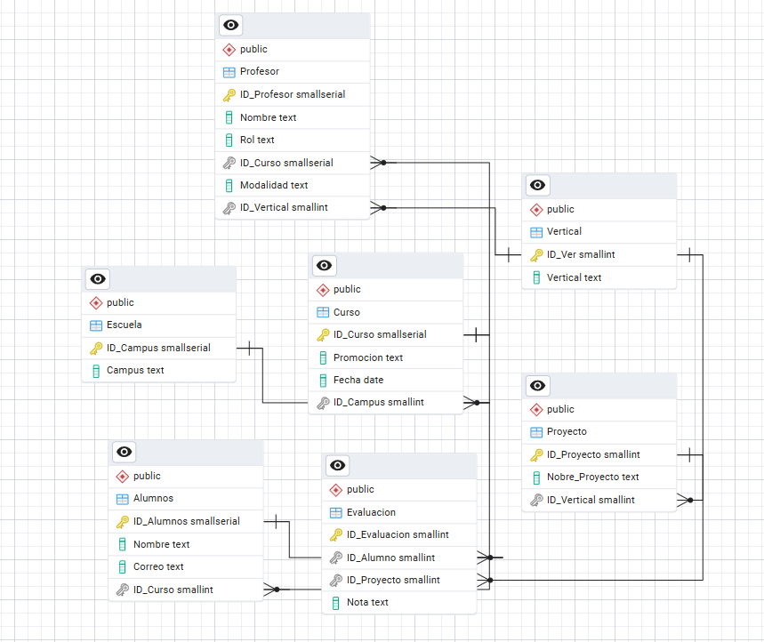

# 📚 Proyecto: Creación de Base de Datos Relacional

Este repositorio contiene el desarrollo de una base de datos relacional basada en un conjunto de datos no normalizados sobre alumnos y profesores de una escuela de bootcamps.

El objetivo del proyecto es aplicar conceptos de modelado, normalización y creación de bases de datos relacionales utilizando PostgreSQL, garantizando escalabilidad y calidad en el diseño.

---

## 🧠 Objetivos del Proyecto

- Transformar datos no normalizados en una estructura relacional eficiente.
- Aplicar normalización para reducir redundancia.
- Diseñar un modelo Entidad-Relación (E/R) y su equivalente lógico.
- Implementar la base de datos en PostgreSQL e insertar datos.
- Permitir consultas eficientes y escalables.

---

## 🖥️ Tecnologías usadas

- SQL para el diseño y carga de las tablas.
- Docker desktop para contenedores de PostgreSQL y pgAdmin4.
- pgAdmin4 como interfaz gráfica para administración de la base de datos.
- Github para el control de versiones.
- PostgreSQL como sistema de gestión de base de datos.

## 🧩 Estructura de la Base de Datos

### 🟢 Modelo Entidad-Relación (E/R)



### 🧱 Modelo Lógico



**Entidades y relaciones principales:**

- `Escuela`: Lista de campus.
- `Curso`: Contiene promoción, fecha y campus.
- `Vertical`: Tipo de formación (DS, FS...).
- `Profesor`: Incluye rol, curso, vertical y modalidad.
- `Alumnos`: Con nombre, correo y curso asociado.
- `Proyecto`: Evaluaciones por vertical.
- `Evaluacion`: Nota de un alumno en un proyecto.

Todas las entidades están correctamente normalizadas e interrelacionadas mediante claves foráneas.

## 🚀 Cómo ejecutar el proyecto

1. Clonar el repositorio:

```
git clone [https://github.com/Migueljimnz08/BBDD_The_Bridge]
```

2. Crea una nueva base de datos (por ejemplo, evaluaciones).

3. Ejecuta el contenido del archivo proyecto.sql para crear las tablas y poblarlas con datos iniciales.

## 📂 Estructura del proyecto

```
BBDD_THE_BRIDGE/
|--assets - imágenes y recursos
|--proyecto.sql - Script SQL para crear tablas e insertar datos
|--README.md - documentación

```

## 📈 Escalabilidad

El modelo está preparado para escalar en:

- Nuevos campus (Madrid, Valencia, etc.)
- Nuevas verticales (Data Science, Full Stack, etc.)
- Modalidades (Online, Presencial)
- Nuevas promociones y aulas

## 👨‍💻 Autores

Trabajo realizado por:

- Jorge Alonso Conde.
- Renan Muniz.
- Vincente Limones.
- Miguel Ángel Jiménez Morante.
