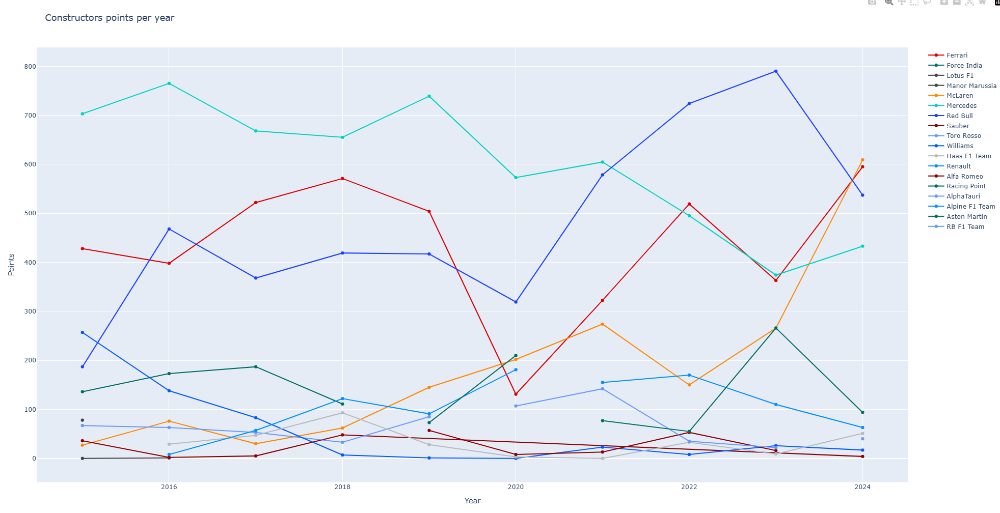
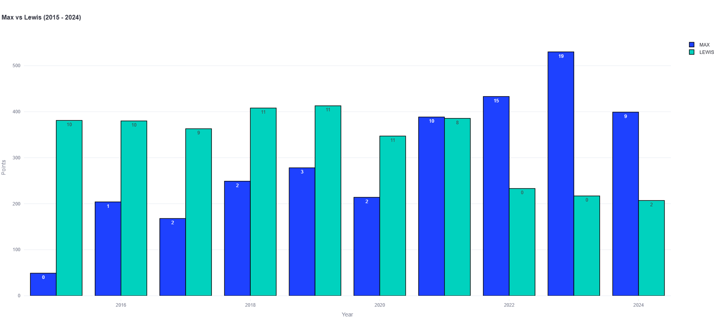
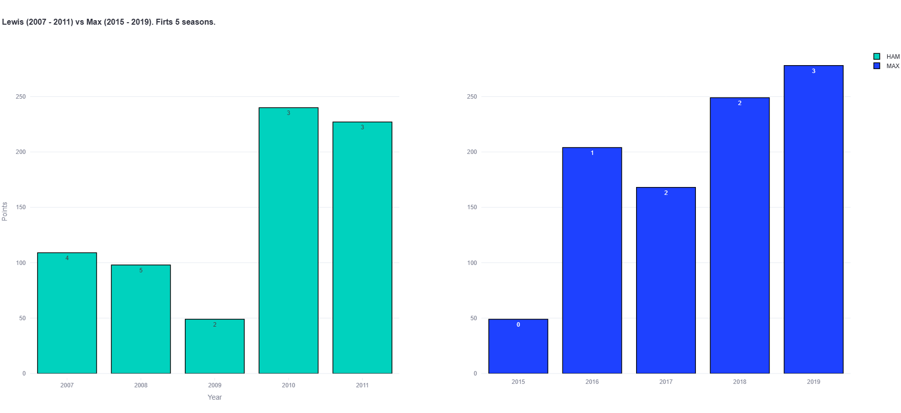

# 🏎️ Formula 1 Performance Analysis (2015 - 2024)
This project presents a comprehensive data-driven analysis of Formula 1 team and driver performance between 2015 and 2024. By leveraging Python, data visualization, and interactive web tools, we aim to explore how the competitive landscape of Formula 1 has evolved, focusing particularly on the rivalry between Mercedes, Red Bull, Lewis Hamilton, and Max Verstappen.

## 📌 Project Objective
The main objective of this project is to:

- ✅Compare the dominance periods of Mercedes and Red Bull in Formula 1
- ✅Analyze the evolution of team and driver performance over a 10-year period
- ✅Explore whether Max Verstappen's 2023 season represents the most dominant performance in F1 history
- ✅Compare the first 5 seasons of Lewis Hamilton and Max Verstappen to assess who had the stronger career start

Through these analyses, we aim to validate or refute the proposed hypotheses.
## 🎯 Project Hypotheses
🔵 Main Hypothesis
The Mercedes team achieved superior results (points and Constructors' Championships) compared to Red Bull between 2015 and 2021. Starting from 2021, Red Bull has dominated Formula 1 based on the same performance metrics.

🟡 Secondary Hypotheses:

Max Verstappen had the most dominant season ever by an F1 driver during the 2023 season, measured by points and race victories.

Lewis Hamilton had a more successful start to his career (first 5 seasons) than Max Verstappen, based on points scored and races won.

## 🛠️ Technologies Used
Python 🐍

Pandas, NumPy for data manipulation

Plotly for interactive visualizations

Streamlit for building the web app

Jupyter Notebooks for exploratory analysis
📈 Features and Deliverables
✅ Interactive visualizations comparing Mercedes and Red Bull dominance
✅ Driver performance analysis: Hamilton vs. Verstappen
✅ Year-by-year evolution of Constructors' and Drivers' Championships
✅ Highlight of Verstappen's 2023 season statistics
✅ Clean, modular project structure following good data science practices
✅ Reproducible code with documented notebooks and utility functions

## 🏁 Data Sources
The project utilizes publicly available Formula 1 datasets, including:

Historical race results

Constructors' Championship standings

Drivers' Championship standings

Individual driver performance statistics
## 🧑‍💻 Author
Renan Muniz

Data Science Student at The Bridge

GitHub: Bisteca

## ⚠️ Disclaimer
This project is for educational purposes only. It is not affiliated with Formula 1, the FIA, or any official motorsport organization. All data used is publicly available and intended solely for academic analysis.

