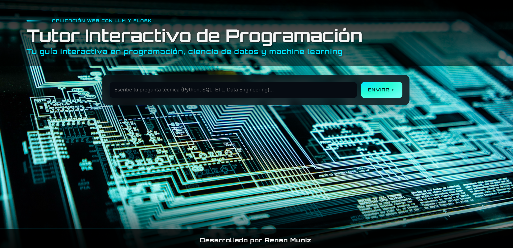

# LLM_App
Tutor Interactive Application for Learning Programming & Data Engineering with LLM

---
# 📌 Description

LLM_App is a web-based interactive tutor powered by a Large Language Model (LLM).
It helps users learn programming, SQL, Python, ETL, Data Analysis, and Data Engineering by providing code examples, explanations, and best practices in real time.

The app automatically replies in the same language as the user’s question and keeps track of Q&A history.

---
# ✨ Features

✅ Ask technical questions (SQL, Python, ETL, Data Engineering, Data Science)

🌐 Multilingual: responds in the same language as the input

💻 Provides code examples + best practices

---
# 🛠️ Tech Stack
| Component           | Technology                                                  |
| ------------------- | ----------------------------------------------------------- |
| **Backend**         | Flask (Python)                                              |
| **Frontend**        | HTML, CSS, JavaScript (Markdown rendering with `marked.js`) |
| **Database**        | PostgreSQL                                                  |
| **LLM Integration** | External LLM API (Groq/OpenAI/etc.)                         |

---

# 🔮 Future Improvements

👤 User authentication (personalized history)

📊 Dashboard with learning statistics

📥 Export Q&A history (CSV / PDF)

🎨 More polished UI (animations, themes)

🎙️ Voice input / file upload support
