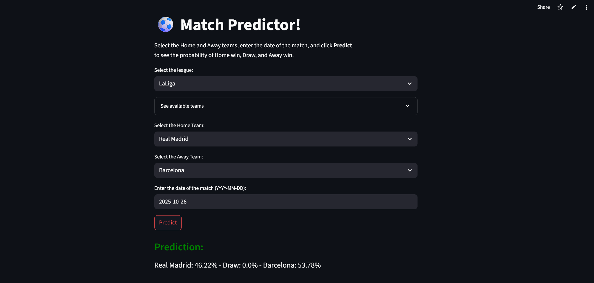

# **⚽ Football Match Outcome Prediction with Machine Learning**
## **https://match-predi.streamlit.app**

---
## 📌 **Project Description**

This project aims to predict football match results (home win or away win) using Machine Learning.

Motivation: to demonstrate how data analytics and classification algorithms can be applied in sports, generating useful insights and supporting decisions in contexts such as sports betting, scouting, and performance analysis.

The project includes:

- Preprocessing of historical match data.

- Training and evaluation of models: Logistic Regression, Random Forest, KNN, XGBoost, and LightGBM.

- Interactive Streamlit app to easily test the model.

---
## 📊 **Dataset Overview**

- Source: [Club Football Match Data 2000-2025](https://github.com/xgabora/Club-Football-Match-Data-2000-2025?tab=readme-ov-file)

- Raw dataset: Original match data with information about teams and leagues.

- Processed dataset (X):

  - Matches: 26,000

  - Features: 108 columns, including team stats, performance metrics, and results

The dataset provides a rich base for football match outcome prediction, containing information on team strength, performance, and historical results.

---
## 🎯 **Project Goals**

1. Build a Machine Learning model to predict football match outcomes.

2. Compare multiple algorithms to improve prediction accuracy:

   - Logistic Regression
   - Random Forest
   - K-Nearest Neighbors (KNN)
   - XGBoost
   - LightGBM

3. Develop an interactive Streamlit app for users to simulate predictions easily.

---
## 🛠️ **Methodology**

Data preprocessing:

- Handling missing values

- Encoding categorical variables

- Normalizing numeric features

- Removing draws initially to improve model accuracy

Models tested:

- Logistic Regression

- Random Forest

- KNN

- XGBoost

- LightGBM

Evaluation metric:

- Accuracy

---
## 📈 **Results**

- Three-class prediction (Home Win, Draw, Away Win): ~50% accuracy

- Two-class prediction (Home Win, Away Win, draw removed): ~70% accuracy

This shows that accuracy improves significantly when reducing the problem to two classes, though the model loses realism in predicting draws.

---
## 🖥️ **Streamlit App**

The interactive web app allows users to:

- Select home and away teams

- Specify the match date

- Predict match outcomes using the trained model

---
## ⚠️ **Limitations**

- Model trained only on historical data; does not account for injuries, weather, or coaching changes.

- Draws were removed to increase accuracy, reducing the ability to predict realistic three-outcome scenarios.

---
## 🚀 **Next Steps**

- Reintroduce draws using class balancing techniques

- Integrate real-time data (injuries, lineups, betting odds)

- Explore additional models and hyperparameter tuning

- Improve interpretability of feature importance with SHAP or similar

---
## 📌 **Conclusion**

- This project demonstrates the application of Machine Learning in football to generate predictions and insights. While limited in predicting draws and real-time factors, it forms a solid foundation for more advanced applications in sports analytics.

---
## ✒️ **Citation**
- Gábor, A. (2025). Club Football Match Data. Retrieved from https://github.com/xgabora/Club-Football-Match-Data-2000-2025/.
