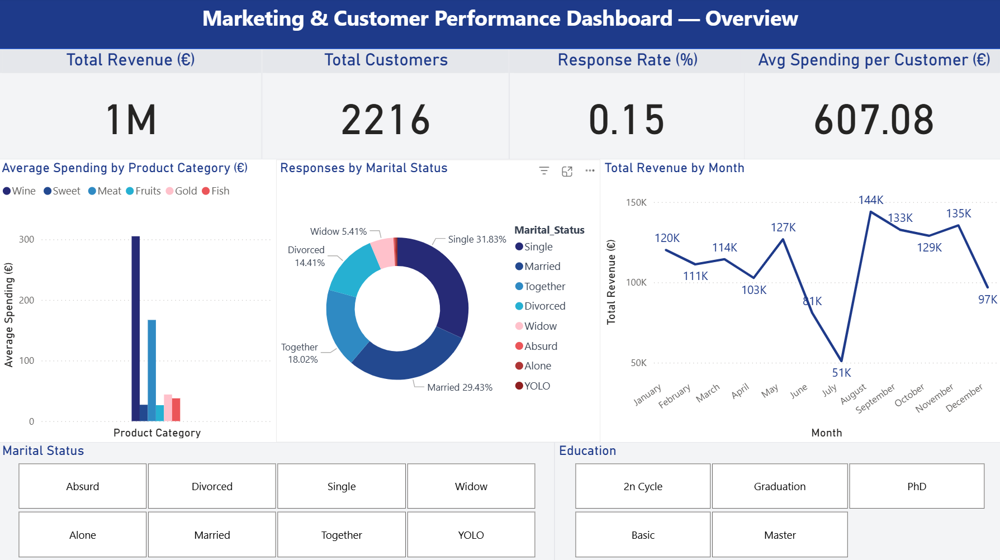
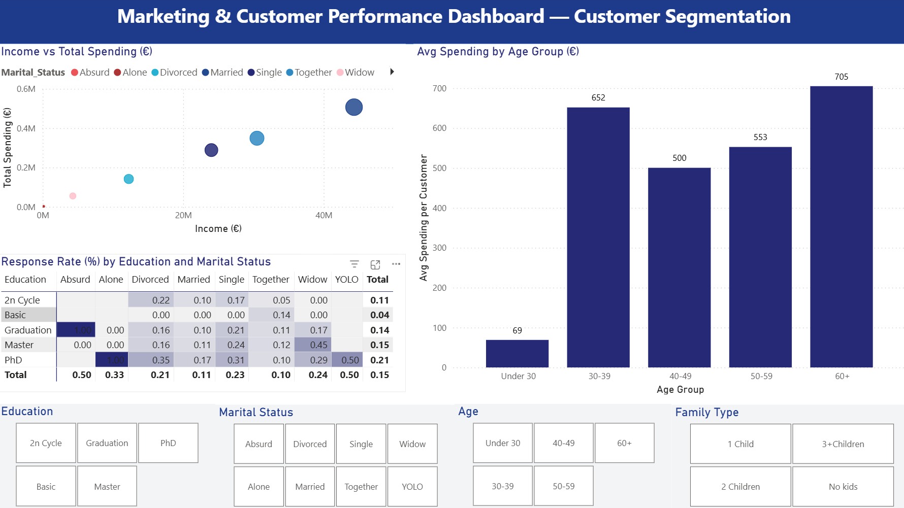

# 📊 Marketing & Customer Performance Dashboard

### 🧭 Overview
This Power BI project analyzes marketing campaign performance and customer behavior  
to identify which segments and channels generate the highest ROI and conversion rates.

---

### 🎯 Objective
To provide marketing teams with actionable insights about customer profiles,  
spending patterns, and campaign effectiveness.

---

### 🧮 Key KPIs
| KPI | Description |
|-----|--------------|
| **Total Revenue (€)** | Sum of all product purchases |
| **Average Spending per Customer (€)** | Mean total spending per client |
| **Response Rate (%)** | % of customers who accepted marketing campaigns |
| **Customer Loyalty (Recency)** | Time since last purchase |
| **Preferred Product Type** | Product category with highest average spending |

---

### 📈 Dashboard Pages

#### 🟦 **Page 1 – Overview**
- Key metrics (Revenue, Avg Spending, Response Rate, Total Customers)
- Bar chart: *Average Spending by Product Category*
- Donut chart: *Responses by Marital Status*
- Line chart: *Total Revenue by Month*
- Filters: *Education*, *Marital Status*

---

#### 🟩 **Page 2 – Customer Segmentation**
- Scatter plot: *Income vs Total Spending*
- Bar chart: *Avg Spending by Age Group*
- Heatmap: *Response Rate by Education × Marital Status*
- Slicers: *Age*, *Education*, *Family Type*

---

#### 💡 **Page 3 – Insights**
- 🪙 High-income customers spend significantly more, especially on wine and meat  
- 🎓 Graduated & married customers show the highest campaign response rates  
- 👴 Older customers (50–59, 60+) demonstrate strong loyalty and lifetime value  
- 🚀 Younger customers (<30) spend less — opportunity for targeted campaigns  
- 🍷 Wine & meat are top-performing categories by revenue

---

### 🧠 Insights Summary
This dashboard reveals that:
- **Income** and **Age** are the strongest predictors of total spending.  
- **Education level** influences campaign response rate.  
- **Product mix** optimization can focus on wine and meat categories.  
- There’s room for improvement in targeting younger segments.

---

### ⚙️ Tools Used
- **Power BI Desktop**
- **DAX & Power Query**
- **Kaggle Dataset**: [Marketing Campaign Dataset](https://www.kaggle.com/datasets/rodsaldanha/arketing-campaign)

---

### 📦 Files Included
- `Marketing_Analytics_Dashboard.pbix` – Power BI file  
- `/screenshots` – images of each dashboard page  
- `README.md` – project documentation  

---

### 👨‍💻 Author
**Renan Muniz**  
📧 luregat@gmail.com 
💼 [LinkedIn Profile](https://www.linkedin.com/in/renan-muniz1310)
