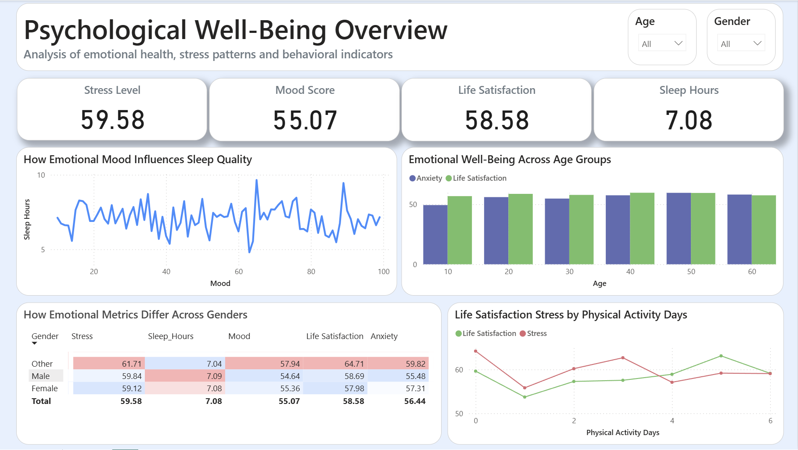

# 🧠 Psychological Well-Being Dashboard — Power BI

This project explores emotional and behavioral well-being indicators using a Power BI interactive dashboard.  
The dataset includes stress levels, mood, sleep hours, anxiety, life satisfaction, and demographic factors.

---

---

## 📊 Dashboard Overview

The dashboard provides:

### 🔹 Key Metrics (KPIs)
- Average Stress Level  
- Average Mood Score  
- Average Life Satisfaction  
- Average Sleep Hours  

### 🔹 Visual Insights
- **How Mood Impacts Sleep Quality**  
- **Emotional Well-Being Across Age Groups (Anxiety vs Life Satisfaction)**  
- **Emotional Differences Across Genders — Heatmap Table**  
- **Physical Activity Influence on Life Satisfaction & Stress**  
- **Slicers for Age & Gender for deeper exploration**

---

## 🎨 Design Choices
- Clean and minimal layout  
- Soft color palette to reflect a psychological theme  
- Clear visual hierarchy  
- Focus on interpretability and storytelling  

---

## 📁 Files Included
- `Psychology_PowerBI.pbix` — Power BI source file
- `Psychology_PowerBI.pdf` — Power BI pdf
- `screenshots/` — Dashboard preview images
- `data/` - Data used in the project
- `README.md` — Project documentation  

---

## 🛠 Tools Used
- **Power BI Desktop**
- Data cleaning and transformations within Power Query

---

## 📎 Dataset
Dataset: `psychology_dataset_500_english.csv`  

---

## 🚀 Future Improvements
- Add calculated measures (DAX) for deeper insights  
- Implement age group binning  
- Explore correlations between more emotional metrics  
